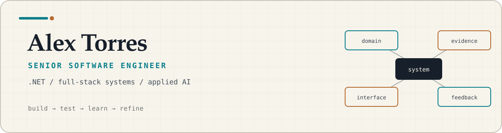

<picture>
  <source media="(prefers-color-scheme: dark)" srcset="./assets/header-dark.svg">
  <source media="(prefers-color-scheme: light)" srcset="./assets/header-light.svg">
  
</picture>

I’m Alex, a U.S. Marine Corps veteran and software engineer focused on .NET, full-stack
development, and applied AI.

Most of my professional work isn’t public, so the projects here are independent examples
based on the kinds of systems and engineering problems I’ve worked on throughout my career.
They don’t contain client code, data, or identifying details, but they do reflect how I
approach architecture, accessibility, edge cases, AI integration, testing, and documentation.

## Selected work

### [VideoScheduler](https://github.com/Alex5350/videoscheduler)

<a href="https://github.com/Alex5350/videoscheduler">
  <picture>
    <source media="(prefers-color-scheme: dark)" srcset="https://raw.githubusercontent.com/Alex5350/videoscheduler/main/docs/screenshots/shot-schedule-dark.png">
    <source media="(prefers-color-scheme: light)" srcset="https://raw.githubusercontent.com/Alex5350/videoscheduler/main/docs/screenshots/shot-schedule.png">
    
  </picture>
</a>

A full-stack video-equipment scheduling system built with Next.js 16, PostgreSQL, Drizzle
ORM, Tailwind CSS v4, and shadcn/ui. It coordinates studios, portable kits, and rover
stations across regional offices with conflict-free one-off and recurring reservations,
DST-correct time handling, Microsoft Teams integration, and calendar exports.

**Engineering focus:** Pure domain rules handle conflicts, recurrence, and time zones, while
PostgreSQL row locks close last-slot race conditions. Authentication and Teams use swappable
boundaries for Entra ID and Microsoft Graph. Validation includes 35 domain tests and 20
real-HTTP integration suites.

---

### [AssetLite](https://github.com/Alex5350/assetlite)

A full-stack IT asset and inventory management system built with .NET 10, Angular 21,
Tailwind CSS v4, and .NET Aspire. It handles asset lifecycle states, hierarchical offices,
barcode and QR labels, search, and Excel/PDF exports through a Clean Architecture API and
signals-first SPA.

**Engineering focus:** Typed domain errors flow from lifecycle rules through RFC 9457
responses into the UI, while Aspire orchestrates the API, SPA, telemetry, and health checks.
The suite includes 339 backend and 62 Angular tests covering domain rules, API contracts,
exports, and frontend behavior.

---

### [LeaveLite MCP](https://github.com/Alex5350/leavelite-mcp)

A .NET 10 Model Context Protocol server for leave and PTO management, built with the official
C# SDK and Clean Architecture. It exposes accrual balances, leave requests, approvals, team
coverage, policy resources, and a review prompt to AI clients while keeping authorization and
business rules in the domain rather than the model.

**Engineering focus:** The 253-test suite includes 27 protocol-level integration tests using
the official MCP client against the real transport. Stable domain error codes, deterministic
time handling, and staffing constraints make tool behavior predictable for AI clients.

---

### [LedgerLite Web](https://github.com/Alex5350/ledgerlite-web)

A full-stack .NET 10 reference application built around a double-entry ledger. I used it to
work through Blazor’s Interactive Auto render mode, authentication across server and
WebAssembly boundaries, a hand-built Tailwind component system, and the less-visible states
that make an interface trustworthy. The combined backend and UI suite currently contains
381 tests.

**What I learned:** render modes change service-lifetime assumptions; design systems become
useful when they encode behavior as well as appearance; and browser testing has a way of
finding integration mistakes that unit tests cannot see.

---

### [LedgerLite API](https://github.com/Alex5350/ledgerlite)

A personal-finance API where the domain has real invariants: journal entries must balance,
closed fiscal periods are immutable, account numbers are unique within a period, and budget
alerts fire once per threshold. It uses .NET 10, C# 14, ASP.NET Core, EF Core, Clean
Architecture, and CQRS without a mediator framework.

**What I learned:** architecture earns its keep when it makes business rules easy to locate,
explain, and test. The 262-test suite focuses on those rules and the HTTP/authentication
boundary rather than chasing coverage for its own sake.

---

### [VA OIG FWA Risk Triage Demo](https://github.com/Alex5350/USWDS-VA-Demo)

A synthetic-data public-sector demo that combines a .NET API, SQL reporting, a
USWDS-oriented React/Next.js interface, and an AI-assisted case workflow. The application
keeps risk scoring explainable and gives the assistant read-only, tool-backed access to case
insights rather than treating generated text as authority.

**What I learned:** accessibility, auditability, and explicit system boundaries are product
features. Applied AI is more useful when it is grounded in the workflow, constrained by the
application, and designed with failure paths in mind.

## Ideas I keep returning to

- Put important business rules where another engineer can find and defend them.
- Treat loading, empty, error, authorization, and recovery states as part of the feature.
- Prefer explicit dependencies and observable failure modes over framework magic.
- Use tests to protect decisions and invariants-not merely to increase a percentage.
- Add AI where it reduces friction without obscuring sources, permissions, or responsibility.

## Working with

**Languages:** C#, TypeScript, SQL  
**Application platforms:** .NET, ASP.NET Core, Blazor, React, Next.js  
**Data and delivery:** EF Core, Dapper, SQL Server, SQLite, Docker, GitHub Actions  
**Applied AI:** streaming interfaces, tool-backed assistants, and structured validation

## Elsewhere

I keep a more traditional account of my background on
[LinkedIn](https://www.linkedin.com/in/alexander-t-3075203b/).
